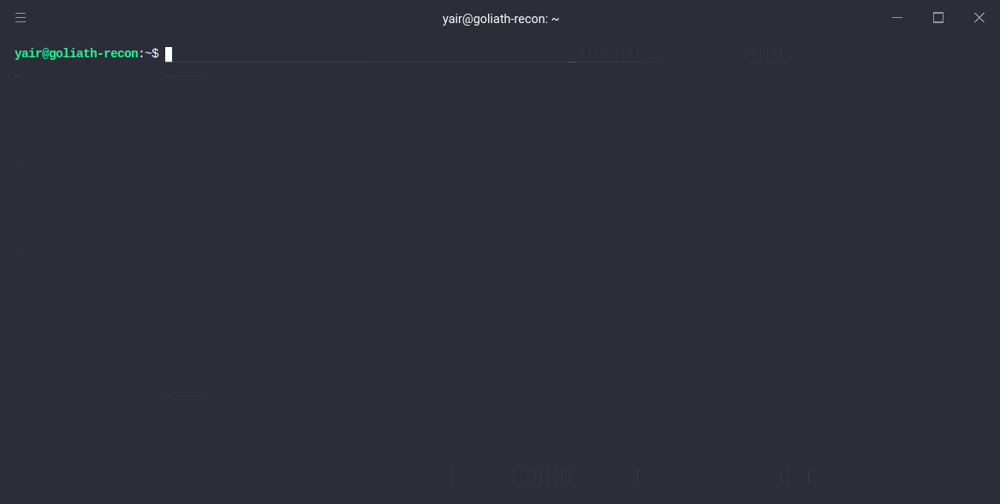

<p align="center">
  
</p>

Horuz!. CLI to interact with ElasticSearch. Keep an eye of your Fuzzing!

Installing
----------
**ElasticSearch**

https://www.elastic.co/guide/en/elasticsearch/reference/current/install-elasticsearch.html


**Pip**

```console
$ sudo apt-get update

$ sudo apt-get -y install python3-pip
```

**Horuz**

```console
$ git clone git@github.com:misalabs/horuz.git

$ cd horuz

$ pip3 install --editable .
```

Usage
-----

```console
$ hz --help

$ hz config server:status
ElasticSearch is connected to http://localhost:9200 successfully!
```

Collect data examples
---------------------
```console
$ hz collect -p x.com -c "ffuf -w ~/SecLists/Discovery/Web-Content/common.txt -u https://example.com/FUZZ"
```


Query search examples
--------------

Search by range dates:

```console
$ hz search -p x.com -q "time:[2020-04-15 TO 2020-05-20]"
```

Search by wildcard in the field

```console
$ hz search -p x.com -q "result.html:*key*" -oJ -f html
```


Pipe the result to other commands

```console
$ hz search -p yahoo.com -q "session:*" -oJ -f _id,session,time | jq ".[].session" | sort -
```

